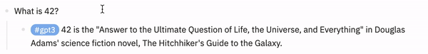
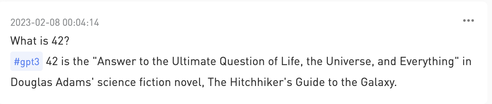

## Logseq To Flomo Plugin

This is simple plugin that send block from logseq to flomo.

## Usage

Set Flomo API in plugin settings.

## Reference

This plugin is written with reference to the following plugins.

https://github.com/maxminly/logseq-send-to-flomo
https://github.com/briansunter/logseq-plugin-gpt3-openai
https://github.com/sawhney17/logseq-pdf-export
https://github.com/shady2k/logseq-inbox-telegram-plugin

